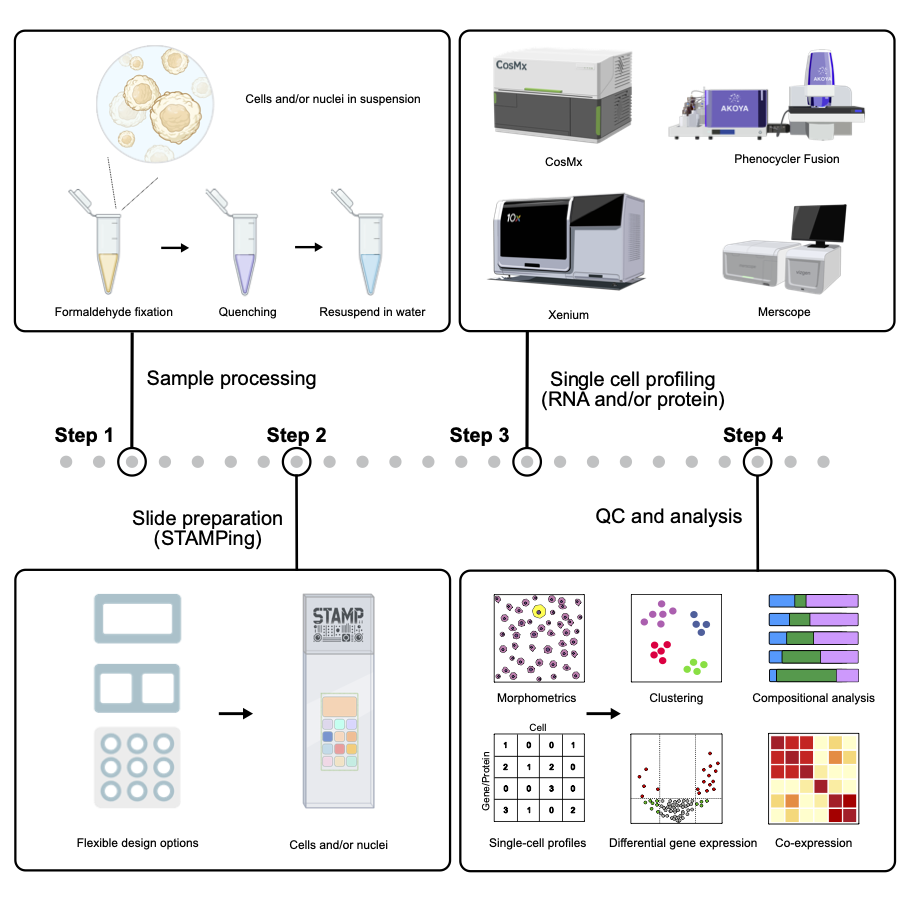
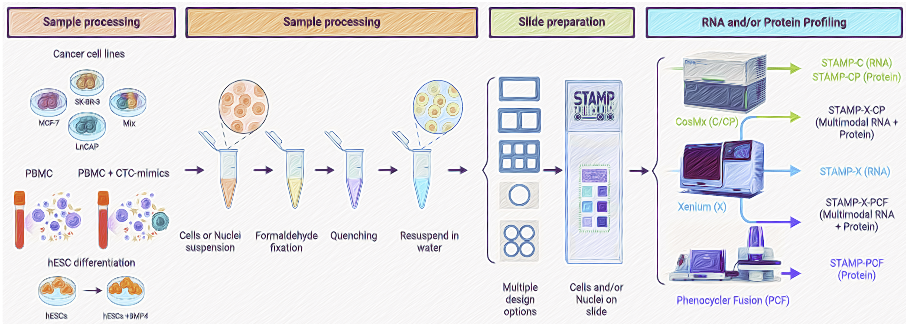

# STAMP: Single-Cell Transcriptomics Analysis and Multimodal Profiling Through Imaging

**STAMP** (Single-Cell Transcriptomics Analysis and Multimodal Profiling) is a scalable, cost-effective approach for single-cell profiling that eliminates sequencing costs by integrating spatial transcriptomics and proteomics imaging. By immobilizing cells onto slides, STAMP enables high-throughput single- and multimodal (RNA, protein, and H&E) profiling while preserving cellular structure. Its flexible format supports large-scale studies across PBMCs, cell lines, stem cells, dissociated tissues, and FFPE samples. STAMP facilitates high-throughput immunophenotyping, rare cell detection, and perturbation studies—demonstrated across over 10 million cells and 6 billion transcripts. This strategy revolutionizes cellular profiling, making it more accessible and scalable for research and clinical applications.

This repository contains all the scripts, notebooks, and reports needed to reproduce the analyses from our manuscript titled [**STAMP: Single-Cell Transcriptomics and Multimodal Profiling Through Imaging**](https://www.cell.com/cell/abstract/S0092-8674(25)00577-X).

---

## Technologies Used

- **Spatial Transcriptomics Platforms**:
  - Bruker CosMx
  - 10X Genomics Xenium
  - Akoya PhenoCycler-Fusion

- **Single-Cell RNA-seq Platforms**:
  - 10X Genomics Flex
  - 10X Genomics 5′
  - 10X Genomics 3′

---

## Repository Structure

- **misc/**
  - `BIN.R`: Contains utility functions used throughout the analyses.
  - `paths`: Contains various file paths used in the project.

- **stamp_1/**, **stamp_2/**, ..., **stamp_n/**:
  - Each folder corresponds to a sample and contains code specific to that sample.
  - **Inside each sample folder:**
    - **Preparation/**: Scripts for loading the expression matrix and creating `SingleCellExperiment` objects.
    - **QC/**: Scripts used to perform quality control.
    - **Analysis/**:
      - `PreProc.R`: Performs preprocessing steps such as normalization, feature selection, and dimensionality reduction.
      - `Clust.R`: Performs clustering analysis.
    - **Lvl1/** and **Lvl2/**: Scripts for different rounds of cell population annotation.
    - **Sub-sample folders** (e.g., `Clines/`, `PBMC/` in `stamp_3/`): Contain analyses for specific sub-samples such as multiplexed slides.

---

Most of this code was run using **R version 4.4.1** on a MacBook Pro M3. Computationally intensive tasks, such as alignment of scRNA-seq FASTQ files to the reference genome, were performed on an HPC cluster.

---

## Recommended Workflow Resources

To help new users understand the analytical workflows used in **STAMP**, we’ve compiled several key resources that were particularly useful during our analyses:

- **[CosMx Analysis Scratch Space](https://nanostring-biostats.github.io/CosMx-Analysis-Scratch-Space/)**: A collection of resources developed by NanoString for working with CosMx data. Notable entries include:
  - **[Basics of CosMx Analysis in R](https://nanostring-biostats.github.io/CosMx-Analysis-Scratch-Space/posts/vignette-basic-analysis/)**: Introductory guide to the CosMx data structure and its analysis in R.
  - **[Cell Typing Basics](https://nanostring-biostats.github.io/CosMx-Analysis-Scratch-Space/posts/cell-typing-basics/)**: Covers fundamental concepts in cell type classification.

- **[InSituType](https://github.com/Nanostring-Biostats/InSituType)**: The clustering tool used in STAMP to analyze CosMx datasets.

- **[Orchestrating Single-Cell Analysis (OSCA) Book](https://bioconductor.org/books/release/OSCA/)**: The single-cell RNA-seq analyses, as well as parts of the analyses of the Xenium datasets, were conducted by following the workflows and best practices outlined in this comprehensive Bioconductor book.
- **[Open source tools for PhenoCycler (and others) proteomics data](https://tinyurl.com/bdcusx7t)**: The proteomics processing of PhenoCycler data was performed using the approach outlined in this document.
- **[Spatial OMICs pipeline and analysis](https://gustaveroussy.github.io/sopa/)**: Built on top of SpatialData, Sopa enables processing and analyses of spatial omics data with single-cell resolution (spatial transcriptomics or multiplex imaging data) using a standard data structure and output.
- **[Analysis of multiplexed proteomics using Seurat](https://satijalab.org/seurat/articles/seurat5_spatial_vignette_2#human-lymph-node-akoya-codex-system)**: This vignette outlines how to use Seurat for analyzing (already processed) PhenoCycler and other spatial proteomics datasets.

---

*For more details, please refer to the manuscript or contact the authors.*
